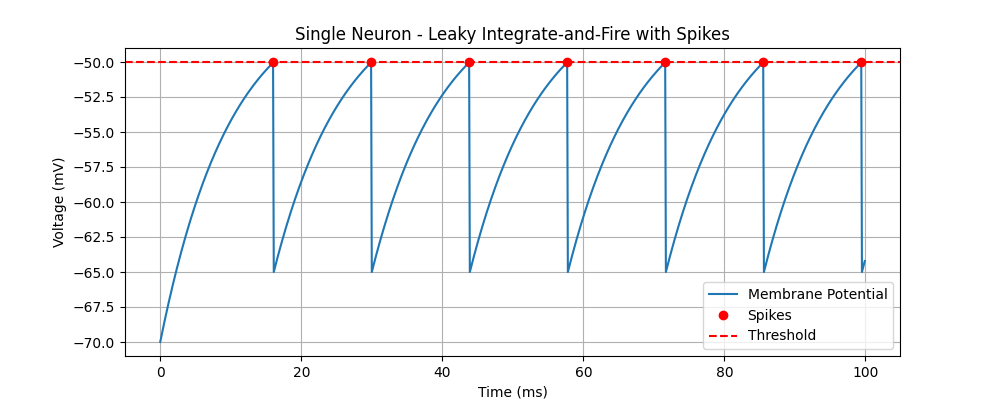

# Single Neuron Model: Leaky Integrate-and-Fire (LIF)



The Leaky Integrate-and-Fire (LIF) model is one of the simplest models of a spiking neuron. It captures the essential features of neuronal excitability:

1.  **Leak**: The membrane potential relaxes back to a resting state.
2.  **Integrate**: Inputs are summed over time.
3.  **Fire**: If the potential crosses a threshold, a spike is generated, and the potential is reset.

## Mathematical Formulation

The change in membrane potential $u$ over time is described by the linear differential equation:

$$ \frac{du}{dt} = \frac{-(u - u_{rest}) + R \cdot I_{ext}}{\tau} $$

Where:
*   $u$: Membrane potential.
*   $u_{rest}$: Resting potential.
*   $\tau$: Membrane time constant (how fast it relaxes).
*   $R$: Membrane resistance.
*   $I_{ext}$: External input current.

## Code Explanation

In `02_single_neuron.py`:

```python
eqs = '''
du/dt = (-(u - u_rest) + R * I_ext) / tau : volt
'''
```

We define this equation as a string. Note the `: volt` at the end—Brian2 requires you to specify the physical unit of the variable being evolved.

## Spiking Mechanism

We add a threshold and reset condition:

```python
threshold='u > -50*mV'
reset='u = -65*mV'
```

When $u$ exceeds $-50$ mV, the simulator records a spike and immediately sets $u$ to $-65$ mV.

## Exercises

1.  Try increasing `I_ext` in the code. Does the firing rate increase?
2.  Try decreasing `tau`. Does the neuron react faster?
