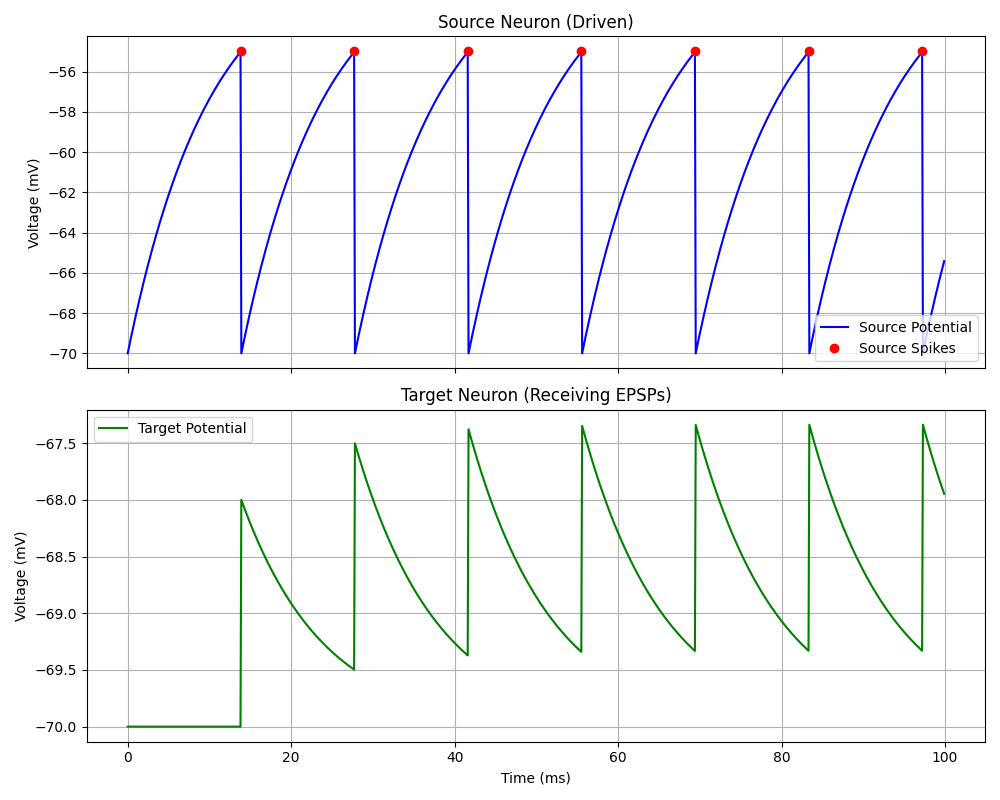

# Synaptic Connections



Synapses connect neurons. In Brian2, `Synapses` allow you to define what happens when a spike arrives (pre-synaptic event) or when the post-synaptic neuron spikes.

## Concept: Event-Driven Simulation
Simulating every molecule in a synapse is too expensive. We use event-driven approximations:
- When the pre-synaptic neuron strikes, we instantly update a variable in the post-synaptic neuron (e.g., membrane potential).

## Code Explanation

In `03_synapses.py`:

```python
S = b2.Synapses(Source, Target, on_pre='u += 2*mV')
S.connect()
```

- `Source`: The group sending spikes.
- `Target`: The group receiving spikes.
- `on_pre`: The code to execute on the target variable when a spike arrives. Here, we instantaneously add 2 mV to `u`.
- `connect()`: Connects all neurons in Source to all in Target (all-to-all).

## Excitatory vs Inhibitory
- **Excitatory**: Adds to the potential (e.g., `u += w`).
- **Inhibitory**: Subtracts from the potential (e.g., `u -= w`).

## Delays
Real synapses have delays. In Brian2:
```python
S.connect()
S.delay = 2 * b2.ms
```
This would make the effect `u += ...` happen 2 ms after the spike.
