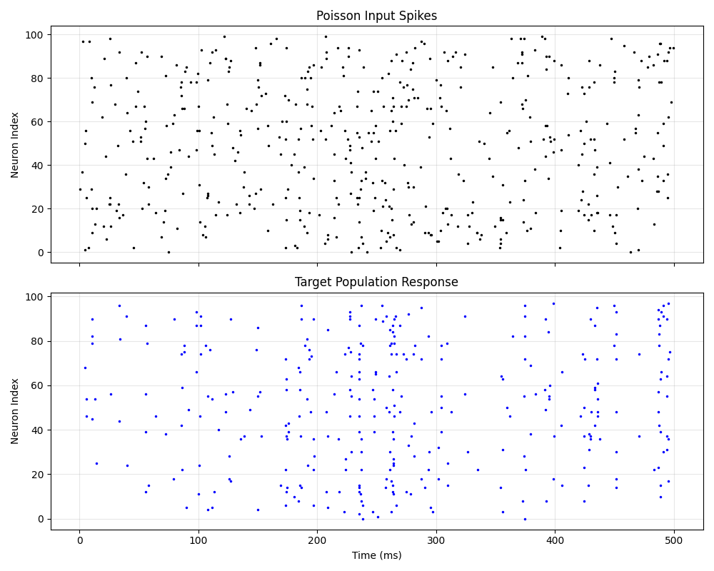

# Networks and Inputs



Neural networks are collections of interacting neurons. To simulate them, we need:
1.  **Populations**: Groups of neurons.
2.  **Connections**: Synapses between groups.
3.  **Inputs**: External signals to drive the network.

## Poisson Inputs
In many simulations, we approximate upstream activity (e.g., from the retina or other brain areas) as random spike trains. A `PoissonGroup` generates spikes according to a Poisson process.

```python
P = b2.PoissonGroup(N, rates=10*b2.Hz)
```
Each of the `N` neurons fires independently at an average rate of 10 Hz.

## Random Connectivity
Instead of connecting every neuron to every other neuron, biological networks are often sparse.

```python
S.connect(p=0.1)
```
This connects each pre-synaptic neuron to each post-synaptic neuron with a probability of 10%.

## Network Dynamics
In `04_network_inputs.py`:
- We have a random input group (`PoissonGroup`).
- It projects to a target population of LIF neurons.
- Because the input is random and the connection is sparse, the potential of target neurons fluctuates (adding and decaying).
- Occasionally, enough inputs arrive effectively simultaneously to cross the threshold, causing a spike.
