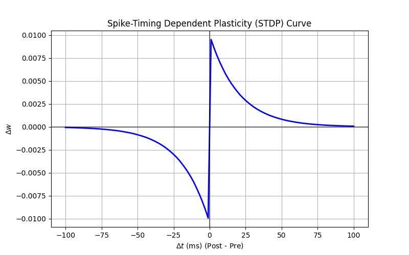

# Plasticity: Spike-Timing Dependent Plasticity (STDP)



Plasticity is the ability of synapses to change their strength over time. STDP is a biologically motivated learning rule based on the precise timing of spikes.

## The Rule
1.  **Potentiation**: If the pre-synaptic neuron strikes *before* the post-synaptic neuron fires, the synapse is strengthened ($\Delta w > 0$). (Causal relationship).
2.  **Depression**: If the pre-synaptic neuron strikes *after* the post-synaptic neuron fires, the synapse is weakened ($\Delta w < 0$). (Acausal relationship).

## Mathematical Formulation
We use "traces" to track activity.
- $a_{pre}$: Increments when pre-neuron spikes, decays over time.
- $a_{post}$: Increments when post-neuron spikes, decays over time.

**Update on PRE spike:**
$$ w \leftarrow w + A_{post} \cdot a_{post} $$
(This handles the depression part: we look at how active the post neuron *recently* was).

**Update on POST spike:**
$$ w \leftarrow w + A_{pre} \cdot a_{pre} $$
(This handles the potentiation part: we look at how active the pre neuron *recently* was).

## Code Explanation

In `05_stdp.py`:

```python
    S = b2.Synapses(Pre, Post, model=eqs_stdp,
                 on_pre='''
                 w = clip(w + A_post * am, 0, inf)
                 ap += 1
                 ''',
                 on_post='''
                 w = clip(w + A_pre * ap, 0, inf)
                 am += 1
                 ''')
```

- `ap` (trace of pre) and `am` (trace of post/minus) track spike histories.
- `on_pre`: Updates weight based on `am` (depression), then updates `ap`.
- `on_post`: Updates weight based on `ap` (potentiation), then updates `am`.
