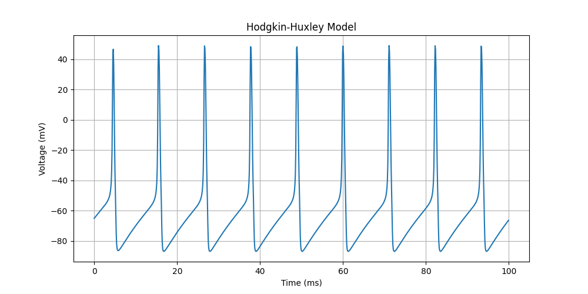

# Hodgkin-Huxley Model



The Hodgkin-Huxley model is a biophysically realistic model of action potential generation. Unlike the LIF model which manually resets potential, the HH model produces spikes through the dynamic interplay of Sodium (Na+) and Potassium (K+) ion channels.

## Ion Channels
- **Sodium (Na+)**: Depolarizing current. Activation gate $m$, inactivation gate $h$.
- **Potassium (K+)**: Repolarizing current. Activation gate $n$.

## Equations
The membrane potential $V$ changes based on the sum of currents:

$$ C_m \frac{dV}{dt} = - g_L(V - E_L) - g_{Na}m^3h(V - E_{Na}) - g_K n^4(V - E_K) + I_{in} $$

Gating variables ($m, h, n$) evolve according to voltage-dependent rate constants.

## Code Formulation

```python
eqs = '''
dv/dt = (gl*(El-v) - g_na*(m**3)*h*(v-ENa) - g_kd*(n**4)*(v-EK) + I)/Cm : volt
dm/dt = ... : 1
dn/dt = ... : 1
dh/dt = ... : 1
'''
```

Note: implementing the rate functions ($\alpha$ and $\beta$) can be verbose, so we put them directly in the equation definition using `exprel` for numerical stability.
