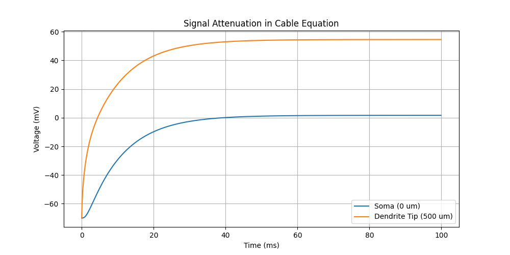

# Multicompartment Models



Neurons are not point particles; they have complex shapes (morphologies). Brian2 allows you to model these using `SpatialNeuron`.

## The Cable Equation
The membrane potential evolves according to the cable equation, which accounts for current flowing *along* the axon/dendrite (axial current) and *through* the membrane (leak/channel currents).

## Morphology
We define trees of cylinders:
```python
morpho = b2.Soma(diameter=30*b2.um)
morpho.dendrite = b2.Cylinder(length=500*b2.um, diameter=2*b2.um, n=50)
```
`n=50` specifies that the dendrite is discretized into 50 compartments.

## Simulation
In `07_multicompartment.py`, we inject current at the tip of the dendrite.
- **Tip**: Voltage rises high.
- **Soma**: Voltage is lower due to attenuation (loss of signal) as it travels down the leaky cable.
