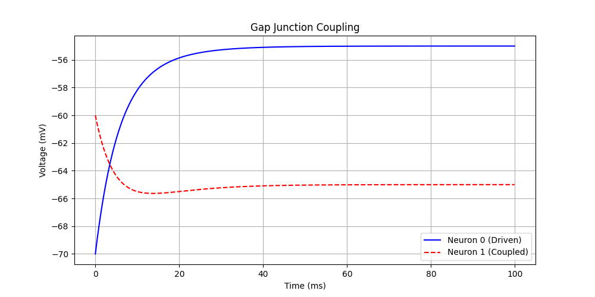

# Gap Junctions (Electrical Synapses)



Gap junctions create a direct electrical coupling between neurons, allowing ions to flow directly between cytoplasms. They are faster than chemical synapses and allow for bi-directional flow.

## Mathematical Formulation
The current flowing into the post-synaptic neuron depends on the difference in voltage:

$$ I_{gap} = g(V_{pre} - V_{post}) $$

- If $V_{pre} > V_{post}$, positive current flows into post (depolarizing).
- If $V_{pre} < V_{post}$, negative current flows into post (hyperpolarizing).

## Code Explanation
In `08_gap_junctions.py`, we implement this using a summed variable mechanism in Synapses.

```python
S = b2.Synapses(G, G, 'w : 1', on_pre='I_gap_post += w * (v_pre - v_post)')
```

Notice `I_gap_post`. This tells Brian2 to sum this value into the variable `I_gap` of the post-synaptic neuron group for every time step. This is a "continuous" specific interaction, distinct from event-driven chemical synapses.

## Result
We drive Neuron 0. Neuron 1 receives no input but follows Neuron 0's potential due to the coupling.
